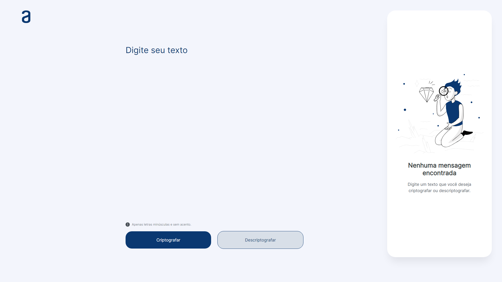

## Challenge Decodificador

<p align="center">
  
</p>

## Descrição

Desafio proposto pelo programa ONE que criptografa e descriptografa um texto. A aplicação foi desenvolvida em HTML, SCSS e JavaScript e utiliza as seguintes chaves de criptografia:

- "a" é convertido para "ai"
- "e" é convertido para "enter"
- "i" é convertido para "imes"
- "o" é convertido para "ober"
- "u" é convertido para "ufat"

## Screenshot da Aplicação

<p align="center">
  
</p>

### Requisitos

- Git
- Node.js
- Visual Studio Code

### Instalação

1. Clone o repositório:

   ```bash
   git clone https://github.com/kauatwn/decodificador-alura.git
   ```

2. Instale a dependência do SASS para utilizar o extensor do CSS:

   ```bash
   npm install
   ```

3. Instale a extensão **Live Sass Compiler** oferecida por Glenn Marks.

4. Instale a extensão **Live Server** oferecida por Ritwick Dey.
